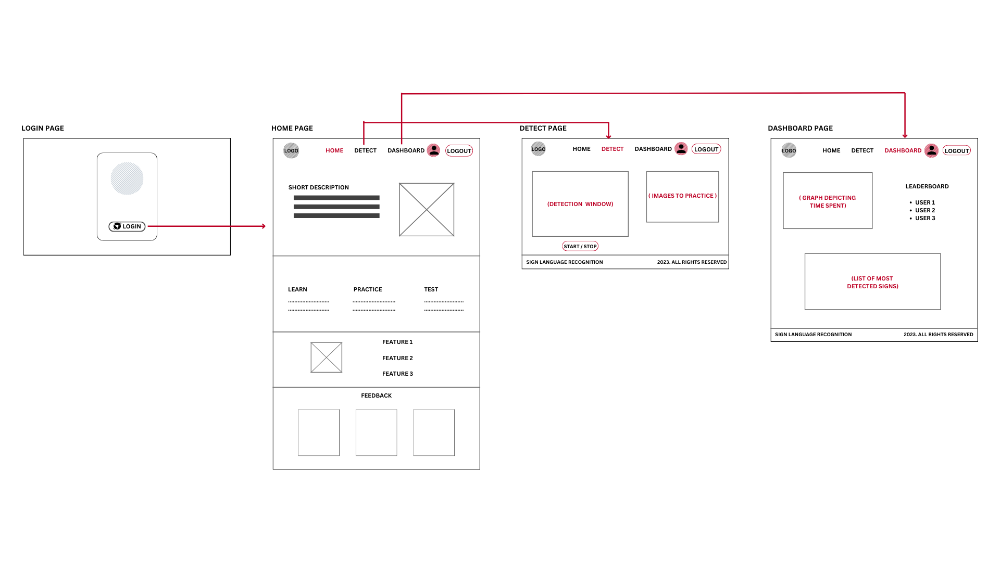
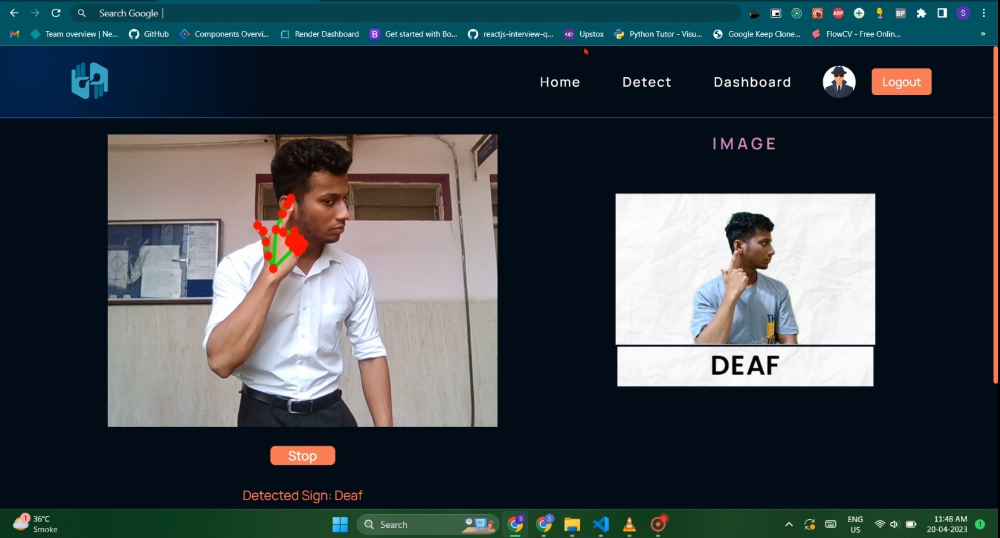
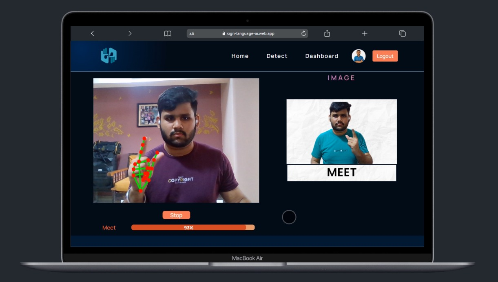
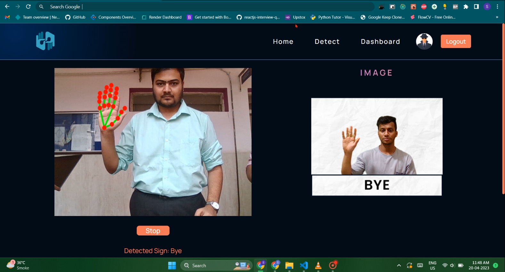
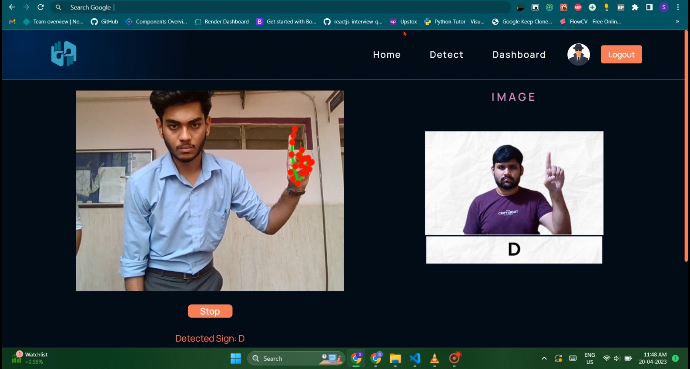
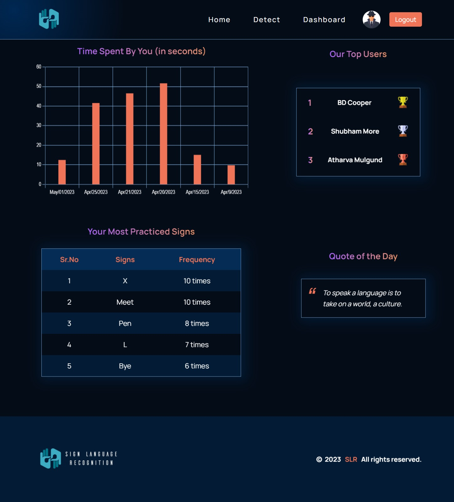

# **Sign Language Recognition for Deaf and Dumb**

- Our sign language recognition project involved creating a custom dataset, preprocessing images, training a model, integrating with React, and hosting with Firebase. 

- The result is a real-time sign language recognition application that recognizes various sign language gestures.

- Our Model is trained for 26 alphabets and 16 ASL words, commonly used in general communication.

## WireFrame

## Features

- Real-Time Recognition

- Easy-to-Use Interface

- Adaptive Learning

- High Accuracy

- Real-Time User Progress Data

## Tech Stack

**Front-end:**

- React
- Redux

**Back-end:**

- Firebase (for hosting, authentication, and storage)

**Machine Learning Framework:**

- MediaPipe

## Team Members

- This project is a group project done in collaboration with the members mentioned below.

| Name            | Email-id                      |
| :-------------- | :---------------------------- |
| Omkar Mandavkar | `omkarmandavkar000@gmail.com` |
| Shubham More    | `shubhamp1251@gmail.com`      |
| Sameer Metkar   | `sameermetkar@gmail.com`      |
| Durgesh Kolhe   | `dkolhe985@gmail.com`         |

## Project Details

- **Our Project Report:** [Report.pdf](https://drive.google.com/file/d/16juuwsmj64JJ915ghxV7OFlqKyAlTQpB/view?usp=share_link)

- **Published Paper:** [Paper.pdf](https://drive.google.com/file/d/1QAuSWb8op7bFkqhItBbyoqwBbxWbSZvw/view?usp=share_link)

- **Dataset Link:** [Sign_Dataset](https://drive.google.com/drive/folders/1LUUknqqRNHAmIZYrcgo-4n2HrM37uFa3?usp=share_link)

- **Gesture Recognition Documentation:** [Mediapipe](https://developers.google.com/mediapipe/solutions/vision/gesture_recognizer)

- **The Model Training File is located in the root folder**

## Authors

- [@omkar-mandavkar](https://github.com/omkarmandavkar/)
- [@shubham-more](https://github.com/shubhammore1251/)
- [@sameer-metkar](https://github.com/sameermetkar/)
- [@durgesh-kolhe](https://github.com/Durgesh240)

## Acknowledgements

- [React](https://react.dev/)
- [mediapipe](https://developers.google.com/mediapipe)
- [Firebase](https://firebase.google.com/)
- [NPM](https://www.npmjs.com/)

## Screenshots

## Support

For support, contact

- E-mail: omkarmandavkar000@gmail.com
- LinkedIn: [Omkar Mandavkar](https://www.linkedin.com/in/omkarmandavkar/)
